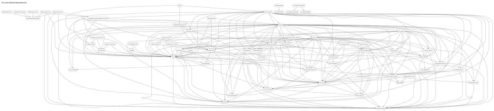
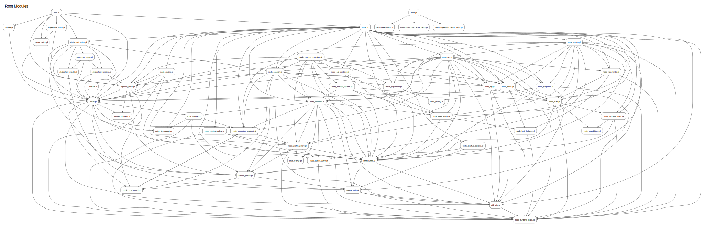
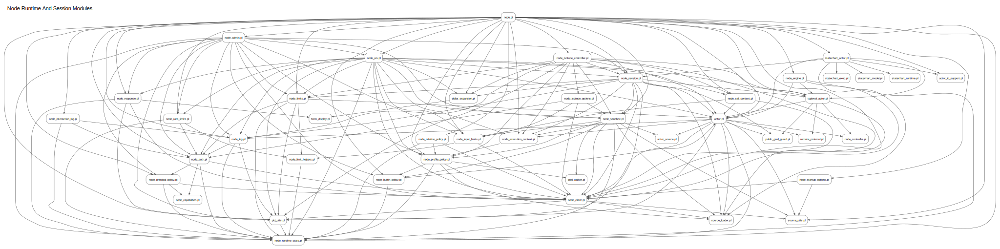
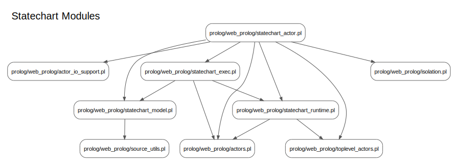
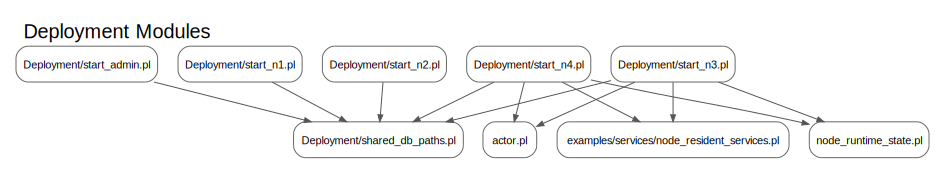
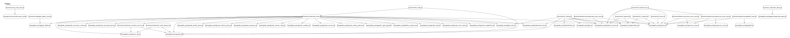
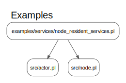

<!-- Generated by tools/generate_dependency_graph.py; do not edit by hand. -->
# Dependency Graph

This file is generated from local `use_module/1-2` directives in this repository.
It tracks project-internal module dependencies only and intentionally omits SWI
library imports, dynamic loading, and runtime-only relationships.

Static graph images are rendered with Graphviz `dot` and stored in
`docs/generated/dependency_graph/`.

Regenerate with:

```bash
python3 tools/generate_dependency_graph.py
```

## Summary

- Prolog files scanned: `97`
- Local dependency edges found: `258`
- Source basis: static `use_module/1-2` directives only
- Renderer: Graphviz `dot` -> SVG

## All Local Module Dependencies

- Nodes: `65`
- Edges: `258`



[Open SVG](docs/generated/dependency_graph/all-local-module-dependencies.svg) | [DOT source](docs/generated/dependency_graph/all-local-module-dependencies.dot)

## Root Modules

- Nodes: `52`
- Edges: `207`



[Open SVG](docs/generated/dependency_graph/root-modules.svg) | [DOT source](docs/generated/dependency_graph/root-modules.dot)

## Node Runtime And Session Modules

- Nodes: `43`
- Edges: `176`



[Open SVG](docs/generated/dependency_graph/node-runtime-and-session-modules.svg) | [DOT source](docs/generated/dependency_graph/node-runtime-and-session-modules.dot)

## Statechart Modules

- Nodes: `10`
- Edges: `14`



[Open SVG](docs/generated/dependency_graph/statechart-modules.svg) | [DOT source](docs/generated/dependency_graph/statechart-modules.dot)

## Deployment Modules

- Nodes: `9`
- Edges: `11`



[Open SVG](docs/generated/dependency_graph/deployment-modules.svg) | [DOT source](docs/generated/dependency_graph/deployment-modules.dot)

## Tests

- Nodes: `32`
- Edges: `38`



[Open SVG](docs/generated/dependency_graph/tests.svg) | [DOT source](docs/generated/dependency_graph/tests.dot)

## Examples

- Nodes: `3`
- Edges: `2`



[Open SVG](docs/generated/dependency_graph/examples.svg) | [DOT source](docs/generated/dependency_graph/examples.dot)

## Source To Local Imports

| Source | Local imports |
| --- | --- |
| `Deployment/shared_db_actor_common.pl` | - |
| `Deployment/shared_db_admin.pl` | - |
| `Deployment/shared_db_common.pl` | - |
| `Deployment/shared_db_n1.pl` | - |
| `Deployment/shared_db_n2.pl` | - |
| `Deployment/shared_db_n3.pl` | - |
| `Deployment/shared_db_n4.pl` | - |
| `Deployment/shared_db_paths.pl` | - |
| `Deployment/start_admin.pl` | `Deployment/shared_db_paths.pl` |
| `Deployment/start_n1.pl` | `Deployment/shared_db_paths.pl` |
| `Deployment/start_n2.pl` | `Deployment/shared_db_paths.pl` |
| `Deployment/start_n3.pl` | `Deployment/shared_db_paths.pl`, `actor.pl`, `examples/services/node_resident_services.pl`, `node_runtime_state.pl` |
| `Deployment/start_n4.pl` | `Deployment/shared_db_paths.pl`, `actor.pl`, `examples/services/node_resident_services.pl`, `node_runtime_state.pl` |
| `actor.pl` | `actor_source.pl`, `node_builtin_policy.pl`, `node_controller.pl`, `node_execution_context.pl`, `node_log.pl`, `node_runtime_state.pl`, `pid_utils.pl`, `public_goal_guard.pl`, `remote_protocol.pl`, `source_loader.pl`, `source_utils.pl` |
| `actor_io_support.pl` | - |
| `actor_source.pl` | `actor_io_support.pl`, `node_execution_context.pl`, `node_runtime_state.pl`, `source_loader.pl` |
| `debug.pl` | - |
| `dollar_expansion.pl` | `term_display.pl` |
| `examples/actors/01 queens.pl` | - |
| `examples/actors/02 grammar.pl` | - |
| `examples/actors/03 expert-system.pl` | - |
| `examples/actors/04 count_server.pl` | - |
| `examples/actors/05 fridge.pl` | - |
| `examples/actors/06 priority_queue.pl` | - |
| `examples/actors/07 ping-pong.pl` | - |
| `examples/actors/08 dining_philosophers.pl` | - |
| `examples/actors/09 parallel.pl` | - |
| `examples/actors/10 simple_toplevel.pl` | - |
| `examples/actors/11 promise-and-yield.pl` | - |
| `examples/actors/12 rpc.pl` | - |
| `examples/actors/13 fridge_server.pl` | - |
| `examples/services/node_resident_services.pl` | `actor.pl`, `node.pl` |
| `examples/services/service_directory.pl` | - |
| `examples/swi-wasm-examples/grammar.pl` | - |
| `examples/swi-wasm-examples/promise-and-yield.pl` | - |
| `examples/swi-wasm-examples/queens.pl` | - |
| `examples/swi-wasm-examples/rpc.pl` | - |
| `examples/tau-examples/grammar.pl` | - |
| `examples/tau-examples/promise-and-yield.pl` | - |
| `examples/tau-examples/queens.pl` | - |
| `examples/tau-examples/rpc.pl` | - |
| `goal_walker.pl` | - |
| `load.pl` | `actor.pl`, `node.pl`, `parallel.pl`, `server_actor.pl`, `statechart_actor.pl`, `supervisor_actor.pl`, `toplevel_actor.pl` |
| `node.pl` | `actor.pl`, `actor_io_support.pl`, `dollar_expansion.pl`, `node_admin.pl`, `node_auth.pl`, `node_builtin_policy.pl`, `node_call_context.pl`, `node_client.pl`, `node_engine.pl`, `node_execution_context.pl`, `node_input_limits.pl`, `node_interaction_log.pl`, `node_isotope_controller.pl`, `node_limits.pl`, `node_log.pl`, `node_principal_policy.pl`, `node_profile_policy.pl`, `node_rate_limits.pl`, `node_relation_policy.pl`, `node_response.pl`, `node_runtime_state.pl`, `node_sandbox.pl`, `node_session.pl`, `node_startup_options.pl`, `node_ws.pl`, `pid_utils.pl`, `source_utils.pl`, `statechart_actor.pl`, `toplevel_actor.pl` |
| `node_admin.pl` | `node_auth.pl`, `node_builtin_policy.pl`, `node_client.pl`, `node_input_limits.pl`, `node_limits.pl`, `node_log.pl`, `node_principal_policy.pl`, `node_profile_policy.pl`, `node_rate_limits.pl`, `node_response.pl`, `node_runtime_state.pl`, `node_sandbox.pl`, `node_session.pl`, `node_ws.pl`, `pid_utils.pl` |
| `node_auth.pl` | `node_capabilities.pl`, `node_client.pl`, `node_principal_policy.pl`, `node_runtime_state.pl` |
| `node_builtin_policy.pl` | `node_runtime_state.pl` |
| `node_call_context.pl` | `actor.pl`, `node_client.pl`, `node_input_limits.pl` |
| `node_capabilities.pl` | - |
| `node_client.pl` | `actor.pl`, `pid_utils.pl`, `source_loader.pl`, `source_utils.pl` |
| `node_controller.pl` | - |
| `node_engine.pl` | `actor.pl`, `node_client.pl`, `node_runtime_state.pl`, `toplevel_actor.pl` |
| `node_execution_context.pl` | `node_profile_policy.pl` |
| `node_input_limits.pl` | `node_client.pl`, `node_limit_helpers.pl` |
| `node_interaction_log.pl` | `node_auth.pl`, `node_log.pl`, `node_runtime_state.pl` |
| `node_isotope_controller.pl` | `actor.pl`, `dollar_expansion.pl`, `node_call_context.pl`, `node_client.pl`, `node_execution_context.pl`, `node_isotope_options.pl`, `node_limits.pl`, `node_log.pl`, `node_profile_policy.pl`, `node_sandbox.pl`, `node_session.pl`, `pid_utils.pl`, `toplevel_actor.pl` |
| `node_isotope_options.pl` | `node_auth.pl`, `node_client.pl`, `node_input_limits.pl`, `node_sandbox.pl` |
| `node_limit_helpers.pl` | `node_runtime_state.pl` |
| `node_limits.pl` | `actor.pl`, `node_auth.pl`, `node_limit_helpers.pl`, `node_runtime_state.pl`, `pid_utils.pl` |
| `node_log.pl` | `node_auth.pl`, `node_runtime_state.pl`, `pid_utils.pl` |
| `node_principal_policy.pl` | `node_capabilities.pl`, `node_client.pl`, `node_runtime_state.pl` |
| `node_profile_policy.pl` | `goal_walker.pl`, `node_builtin_policy.pl`, `node_client.pl`, `node_runtime_state.pl`, `source_loader.pl` |
| `node_rate_limits.pl` | `node_auth.pl`, `node_limit_helpers.pl`, `node_runtime_state.pl` |
| `node_relation_policy.pl` | `node_client.pl`, `node_profile_policy.pl`, `node_runtime_state.pl` |
| `node_response.pl` | `node_client.pl`, `node_runtime_state.pl`, `pid_utils.pl`, `term_display.pl` |
| `node_runtime_state.pl` | - |
| `node_sandbox.pl` | `actor_source.pl`, `goal_walker.pl`, `node_builtin_policy.pl`, `node_client.pl`, `node_execution_context.pl`, `node_input_limits.pl`, `node_profile_policy.pl`, `node_runtime_state.pl`, `source_loader.pl`, `source_utils.pl` |
| `node_session.pl` | `actor.pl`, `dollar_expansion.pl`, `node_client.pl`, `node_execution_context.pl`, `node_limits.pl`, `node_log.pl`, `node_sandbox.pl`, `pid_utils.pl`, `public_goal_guard.pl`, `source_loader.pl`, `toplevel_actor.pl` |
| `node_startup_options.pl` | `node_client.pl`, `source_utils.pl` |
| `node_ws.pl` | `actor.pl`, `dollar_expansion.pl`, `node_auth.pl`, `node_call_context.pl`, `node_client.pl`, `node_execution_context.pl`, `node_input_limits.pl`, `node_limits.pl`, `node_log.pl`, `node_profile_policy.pl`, `node_rate_limits.pl`, `node_response.pl`, `node_runtime_state.pl`, `node_sandbox.pl`, `node_session.pl`, `pid_utils.pl`, `toplevel_actor.pl` |
| `parallel.pl` | `actor.pl` |
| `pid_utils.pl` | `node_runtime_state.pl` |
| `public_goal_guard.pl` | `node_execution_context.pl` |
| `remote_protocol.pl` | - |
| `run.pl` | - |
| `server.pl` | `actor.pl` |
| `server_actor.pl` | `actor.pl` |
| `shared_db.pl` | - |
| `source_loader.pl` | `node_client.pl`, `public_goal_guard.pl`, `source_utils.pl` |
| `source_utils.pl` | `node_runtime_state.pl`, `pid_utils.pl` |
| `statechart_actor.pl` | `actor.pl`, `actor_io_support.pl`, `node_session.pl`, `source_loader.pl`, `statechart_exec.pl`, `statechart_model.pl`, `statechart_runtime.pl`, `toplevel_actor.pl` |
| `statechart_exec.pl` | `actor.pl`, `statechart_model.pl`, `statechart_runtime.pl` |
| `statechart_model.pl` | `source_utils.pl` |
| `statechart_runtime.pl` | `actor.pl`, `toplevel_actor.pl` |
| `supervisor_actor.pl` | `actor.pl`, `server_actor.pl` |
| `term_display.pl` | - |
| `test.pl` | `tests/node_tests.pl`, `tests/statechart_actor_tests.pl`, `tests/supervisor_actor_tests.pl` |
| `tests/actor_tests.pl` | `actor.pl`, `node.pl`, `toplevel_actor.pl` |
| `tests/goal_walker_tests.pl` | `goal_walker.pl` |
| `tests/multi_node_harness.pl` | `actor.pl`, `node.pl` |
| `tests/node_tests.pl` | `actor.pl`, `dollar_expansion.pl`, `examples/services/node_resident_services.pl`, `goal_walker.pl`, `node.pl`, `node_auth.pl`, `node_call_context.pl`, `node_execution_context.pl`, `node_principal_policy.pl`, `node_profile_policy.pl`, `node_relation_policy.pl`, `node_response.pl`, `node_runtime_state.pl`, `node_sandbox.pl`, `node_session.pl`, `node_startup_options.pl`, `pid_utils.pl`, `public_goal_guard.pl`, `statechart_actor.pl`, `toplevel_actor.pl` |
| `tests/parallel_tests.pl` | `actor.pl`, `parallel.pl` |
| `tests/server_actor_tests.pl` | `actor.pl`, `server_actor.pl` |
| `tests/statechart_actor_tests.pl` | `actor.pl`, `statechart_actor.pl`, `toplevel_actor.pl` |
| `tests/supervisor_actor_tests.pl` | `actor.pl`, `server_actor.pl`, `supervisor_actor.pl` |
| `tests/toplevel_actor_tests.pl` | `actor.pl`, `toplevel_actor.pl` |
| `toplevel_actor.pl` | `actor.pl`, `node_controller.pl`, `public_goal_guard.pl`, `remote_protocol.pl`, `source_loader.pl` |

## Notes

- This artifact is generated. Edit the generator, not this file.
- A missing edge here does not prove the absence of a runtime dependency.
  Predicates loaded via `load_*` options, `consult/1`, or remote node mechanisms
  are outside the scope of this graph.
- Local import resolution first tries paths relative to the importing file and then
  falls back to the repository root.
