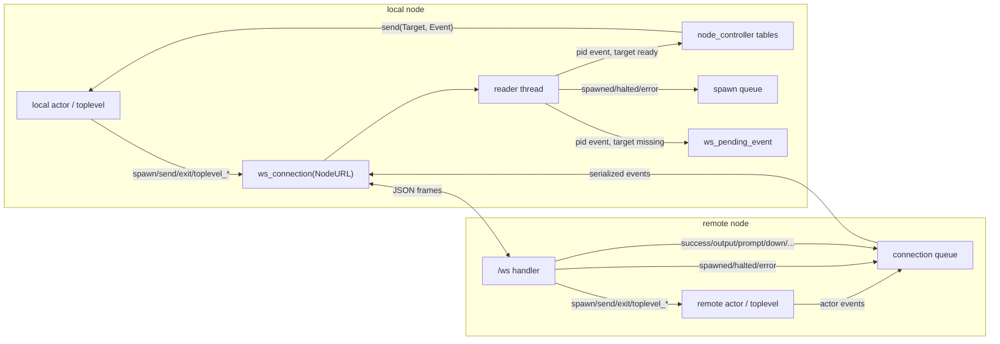
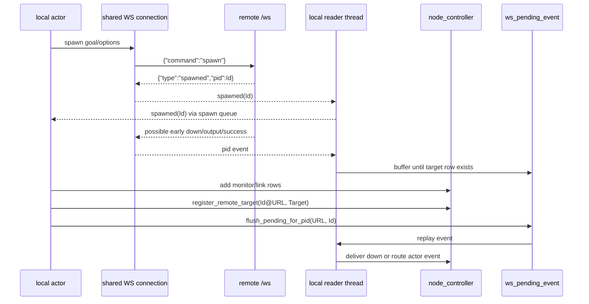
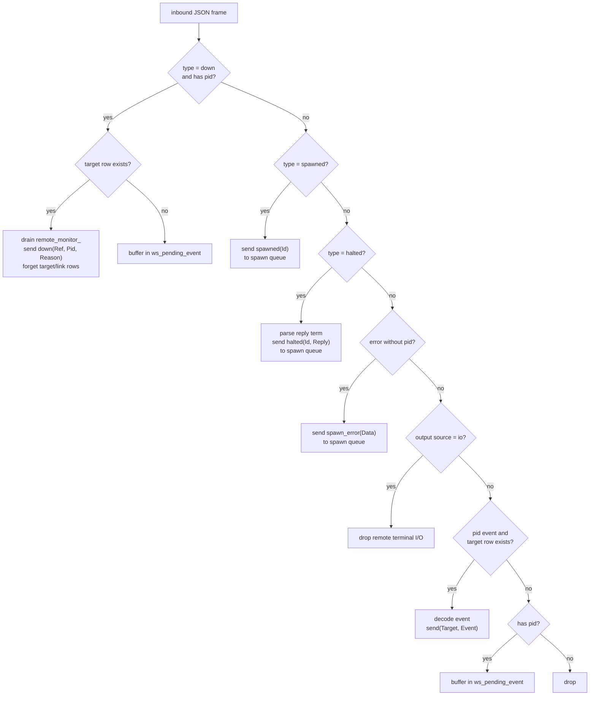

# Web Prolog Cross-Node Architecture

A porting guide for implementers building a Web Prolog–compatible
cross-node actor layer in another Prolog system.  Defines the wire
protocol, the local data structures, the dispatch algorithm, and the
lifecycle invariants that a port must satisfy.

The document is self-contained.  It assumes the host Prolog system
already provides a local actor model in the style of Chapter 2–3 of
*The Prolog Trinity*; §2 below restates the
prerequisites precisely.

---

## 1. Conceptual model

A **node** is a Prolog process exposing an HTTP server and a
WebSocket endpoint at `/ws`.  Every node has a stable URL (the
*node URL*) that doubles as its identity.  Nodes communicate by
sending JSON frames over WebSockets.  Within a node, ordinary local
actor primitives (`spawn/3`, `send/2`, `exit/2`, `monitor/2`,
`receive/1`, link/monitor tables) are unchanged.

For cross-node operations, each node hosts a **node controller**:
a Prolog module that owns three dynamic tables and a small set of
helper predicates.  The controller is the only mediator between
local actors and the inter-node WebSockets.  Per pid there is no
separate local actor; events, sends, exits, monitor delivery, and
link propagation all flow through the controller and the per-node
WebSocket connections.

The architecture rests on three properties:

1. **Pid transparency.**  A canonical pid `Id@URL` denotes the same
   actor regardless of which node holds the reference.  Local
   primitives operate on `Id@URL` identically to a bare local pid.
2. **Two-step messaging (the *ether*).**  Send is a semantic act of
   placing an in-flight record into a notional system queue; delivery
   is a separate step that puts the message into the receiver's
   mailbox.  An implementation may collapse the two steps locally;
   across the network the in-flight phase is realised by the WS
   connection between the two nodes.
3. **Containment.**  Default `link(true)` for every cross-node spawn
   means a parent's death deterministically tears down its remote
   children.  Combined with controller cleanup on connection drop,
   no orphan can outlive its causal context.

These three are testable invariants; see §11.

---

## 2. Host actor model — prerequisites

The host system must provide the following.  The names below are the
ones used in the reference implementation; rename freely.

### 2.1 Pids

- **Local pid**: an integer in a defined range.  The reference uses
  10-digit positive integers chosen at random per spawn so that
  guessing a live pid is computationally infeasible — names are
  themselves the capability handle (§9.3 of the book).
- **Canonical pid**: a compound term `Id@URL`.  The local pid `Id`
  and the canonical `Id@SelfURL` are interchangeable; conversion is
  provided by `canonical_pid/2`.

### 2.2 Required predicates

| Predicate | Purpose |
|---|---|
| `self/1` | Canonical pid of the current actor or thread |
| `canonical_pid/2` | Normalize pid to `Id@URL` |
| `make_id/1` | Generate a fresh, unguessable id (used for pids and Refs) |
| `spawn/3` | Local spawn with options `node`, `link`, `monitor`, `monitor_target`, `monitor_ref` |
| `send/2` | Send to a pid's mailbox (local) |
| `exit/2` | Terminate an actor (local) |
| `monitor/2` | Install a monitor on an actor |
| `demonitor/1` | Remove a monitor by Ref |
| `receive/1`, `receive/2` | Selective mailbox dequeue with timeout option |
| `register/2`, `whereis/2`, `unregister/1` | Local name registry |
| `at_exit/1` hook on threads | Run cleanup on any termination path |

### 2.3 Local link and monitor tables

```prolog
:- dynamic link/2.        % Parent, Child (both canonical pids)
:- dynamic monitor/3.     % Watcher, Pid, Ref
```

The host's `stop/2` (or equivalent at_exit cleanup) walks these:

```prolog
stop(Pid, Parent) :-
    canonical_pid(Pid, GlobalPid),
    retractall(link(Parent, GlobalPid)),
    forall(retract(link(GlobalPid, ChildPid)),
           exit(ChildPid, kill)),
    down_reason(Pid, Reason),
    forall(retract(monitor(Other, GlobalPid, Ref)),
           Other ! down(Ref, GlobalPid, Reason)).
```

For cross-node compatibility the host must additionally drain the
controller's `remote_link_/2` table inside `stop/2`; see §8.

### 2.4 The `down/3` message

All monitor termination notifications are delivered as the
canonical 3-arity term:

    down(Ref, Pid, Reason)

where `Ref` is the monitor's reference (or `Pid` itself when
`monitor(true)` was used at spawn time, per the convention in
manual.html:210), `Pid` is the canonical pid that died, and
`Reason` is a Prolog term describing the exit reason.

---

## 3. The node-controller module

### 3.1 Dynamic state

```prolog
:- module(node_controller, [...]).

:- op(200, xfx, @).

:- dynamic remote_target_/2.     % CompoundPid, LocalTarget
:- dynamic remote_monitor_/3.    % Watcher, CompoundPid, Ref
:- dynamic remote_link_/2.       % LocalParent, CompoundPid
```

The trailing underscore on the dynamic predicate names is a deliberate
convention: the public API is a set of helper predicates listed
below, so direct database access is reserved for the controller
module itself.

### 3.2 Semantics of each table

**`remote_target_(CompoundPid, Target)`** — for each remote pid this
node knows about, the local destination that should receive its
actor-level events (success, prompt, output suppressed, stop, abort,
responded, …).  `Target` is either a local pid, a registered name,
or a message queue.  The presence of a row is the **readiness
marker**: while the row exists, the local side has finished
installing every monitor and link it intends to install for the pid.

**`remote_monitor_(Watcher, CompoundPid, Ref)`** — every cross-node
monitor.  Drained when the remote pid dies; delivery sends
`down(Ref, CompoundPid, Reason)` to each `Watcher`.

**`remote_link_(LocalParent, CompoundPid)`** — every cross-node link
from a local parent to a remote child.  Used by the local parent's
`stop/2` to propagate exits to remote children.

### 3.3 Public API

```prolog
%  Target table
register_remote_target(+CompoundPid, +LocalTarget) is det.
forget_remote_target(+CompoundPid) is det.
current_remote_target(?CompoundPid, ?LocalTarget) is nondet.

%  Monitor table
add_remote_monitor(+Watcher, +CompoundPid, +Ref) is det.
remove_remote_monitor_by_ref(+Ref) is det.
remove_remote_monitor_by_pid(+CompoundPid) is det.
take_remote_monitors_for_pid(+CompoundPid, -Entries) is det.   % atomic drain

%  Link table
add_remote_link(+LocalParent, +CompoundPid) is det.
remove_remote_link(+LocalParent, +CompoundPid) is det.
take_remote_children_for_parent(+LocalParent, -Children) is det.

%  Node-scoped (used by connection-drop cleanup)
take_remote_monitors_on_node(+NodeURL, -Entries) is det.
drop_remote_state_for_node(+NodeURL) is det.
```

The atomic drains (`take_*`) combine a `findall + retract` so a
delivery path can pull state out exactly once.

### 3.4 Controller topology

The controller is node-scoped, not pid-scoped.  The only long-lived
transport object between two nodes is the shared WebSocket connection;
the controller tables say how events coming back on that connection
map into local actor state.



---

## 4. Wire protocol

### 4.1 Connections

Each node maintains, on demand, one **outbound WebSocket connection
per remote node URL**.  Connection state is keyed by the remote URL
and reused for all cross-node operations to that remote.  Per
connection there is:

- one socket;
- one reader thread (runs the inbound dispatch loop, §6);
- one per-connection **spawn queue** — an in-process message queue
  used as the rendezvous for `spawned`, `halted`, and `spawn_error`
  responses to synchronous requests (`remote_request_spawn`,
  `remote_request_halt`);
- one **send mutex** that serializes outbound frames so that
  per-(sender, receiver) FIFO is preserved.

When opening the connection the local node identifies itself in two
HTTP request headers:

    X-Web-Prolog-User: node:<SelfURL>
    X-Web-Prolog-Capabilities: execute,internal_transport

These headers are *claims*.  Whether the remote node honors them is
governed by its peer-network policy — see §4.2 below.  If the
remote node accepts the `internal_transport` capability claim, the
connecting node bypasses ownership checks on ws_actors, rate limits,
and per-principal resource caps on the remote node.  The Prolog-level
sandbox is profile-based and is **not** bypassed by
`internal_transport`.

### 4.2 Trust model for `internal_transport`

The `internal_transport` capability is a serious privilege escalation
on the receiving node: it removes the boundary between independent
clients.  A port must be careful about who is allowed to claim it.

**The reference implementation grants `internal_transport` to a
request iff all three conditions hold:**

1. `X-Web-Prolog-User` starts with `"node:"`.
2. `X-Web-Prolog-Capabilities` lists `internal_transport`.
3. The HTTP peer address is either loopback (`127.0.0.1` / `::1`)
   or in an RFC1918 private range (`10/8`, `172.16/12`,
   `192.168/16`).

The headers alone are not sufficient.  In particular, a
`X-Web-Prolog-Internal-Proxy: true` header from a non-private peer is
ignored — the peer-network position is the trust boundary.  This
closes the failure mode where a node whose HTTP port is reachable
from the internet without a header-stripping reverse proxy would
otherwise grant `internal_transport` to any caller that sets the
header.

**Deployment implications**:

- A node intended to be public should be fronted by a reverse proxy
  that strips inbound `X-Web-Prolog-*` headers from external traffic
  and only re-injects them on connections originating from the
  trusted private network (e.g. a docker bridge).  The reference
  Caddyfile is structured exactly this way.
- The default RFC1918 trust is appropriate for self-contained
  container networks.  On a shared corporate LAN it is too
  permissive; in that environment a port should either narrow the
  trusted CIDR set, or layer an HMAC / shared-secret token check on
  top of the network check.
- A port that wishes to support stronger mutual authentication can
  add an `X-Web-Prolog-Auth` header carrying an HMAC over a nonce +
  the principal id + the capabilities list, signed with a
  per-cluster shared secret.  The network-peer check then becomes
  defense in depth rather than the sole trust boundary.

### 4.3 Outbound commands

JSON object per WebSocket frame.  All commands have a `command`
field.  Prolog terms in arguments are encoded as wire atoms via
`term_to_wire_atom/2` (essentially `write_term/2` with
`quoted(true)` and `numbervars(true)`).

| `command` | Fields | Response |
|---|---|---|
| `spawn` | `goal`, `options` | `spawned` or `error` |
| `toplevel_spawn` | `options` | `spawned` or `error` |
| `send` | `pid`, `message` | (none) |
| `exit` | `pid`, `reason` | (none, observed indirectly via `down`) |
| `toplevel_call` | `pid`, `goal`, `template`, `format`, `limit`, `offset`, `once` | `success` / `failure` / `error` / streaming events |
| `toplevel_next` | `pid`, `limit` | as `toplevel_call` |
| `toplevel_stop` | `pid` | `stop` |
| `toplevel_halt` | `pid` | `halted` |

### 4.4 Inbound events

Each inbound JSON frame has a `type` field plus event-specific
arguments.

| `type` | Fields | Routed to |
|---|---|---|
| `spawned` | `pid` | spawn queue |
| `halted` | `pid`, `reply` | spawn queue (reply parsed back to a term) |
| `error` (no `pid`) | `data` | spawn queue as `spawn_error` |
| `down` | `ref`, `pid`, `reason` | local monitors via controller |
| `success` | `pid`, `data`, `more` | controller target |
| `failure` | `pid` | controller target |
| `error` (with `pid`) | `pid`, `data` | controller target |
| `output` | `pid`, `data`, optional `source` | controller target (dropped if `source="io"`) |
| `prompt` | `pid`, `data` | controller target |
| `stop` / `abort` / `responded` | `pid` | controller target |

`pid` fields are either bare integers (when the pid belongs to the
sender node) or strings of the form `"Id@URL"`.  The receiver
normalizes both forms.

### 4.5 Pid normalization

```prolog
normalize_remote_pid(I, I) :- integer(I), !.
normalize_remote_pid(A, P) :-
    atom(A), !, normalize_remote_pid_atom(A, P).
normalize_remote_pid(S, P) :-
    string(S), atom_string(A, S), normalize_remote_pid_atom(A, P).

normalize_remote_pid_atom(A, P) :-
    (   atom_number(A, P)
    ->  true
    ;   term_to_atom(T, A), T = P@_
    ).
```

The integer form is the wire shorthand for "pid on the sender's own
node"; the receiver pairs it with the connection's `NodeURL` to form
the canonical compound.

### 4.6 Reasons

Exit reasons (`exit/2` Reason argument, `down/3` Reason field) are
arbitrary Prolog terms encoded as wire atoms.  Common values:

| Reason | Meaning |
|---|---|
| `true` | Natural normal exit (thread returned successfully) |
| `kill` | Explicit kill from `exit(Pid, kill)` |
| `connection_closed` | Synthesized when the inter-node WS dropped |
| `noproc` | Pid was never alive or already gone |
| any user term | User-supplied via `exit(Pid, MyReason)` |

The wire decoder for reasons tries `term_string/2` first; on
failure it falls back to interpreting the value as an atom.

### 4.7 Wire format conventions

- JSON booleans are `true` / `false`, never the strings `"true"` /
  `"false"`.
- Prolog terms are quoted+numbervars'd so that variables come back as
  fresh anonymous variables on the receiver side.
- Empty `options` is `"[]"` (a wire atom of an empty list), never a
  JSON empty array.

---

## 5. Operations

### 5.1 Spawn (bare actor) on a remote node

Caller flow inside `spawn/3` when `node(URL)` is present and not
local:

```prolog
spawn_remote(Goal, RemotePid@NodeURL, Node0, Options) :-
    self(Self),
    node_url_atom(Node0, NodeURL),
    strip_module(Goal, GoalModule0, PlainGoal),
    normalize_goal_module(GoalModule0, PlainGoal, SourceModule),
    term_to_wire_atom(PlainGoal, GoalAtom),
    remote_spawn_options(Options, SourceModule, RemoteOptions),
    term_to_wire_atom(RemoteOptions, RemoteOptionsAtom),
    remote_request_spawn(NodeURL, json{
        command: spawn,
        goal: GoalAtom,
        options: RemoteOptionsAtom
    }, RemotePid),
    CompoundPid = RemotePid@NodeURL,
    option(monitor(Monitor), Options, false),
    (   Monitor == true
    ->  assertz(monitor(Self, CompoundPid, CompoundPid)),
        node_controller:add_remote_monitor(Self, CompoundPid, CompoundPid)
    ;   true
    ),
    option(link(Link), Options, true),
    (   Link == true
    ->  assertz(link(Self, CompoundPid)),
        node_controller:add_remote_link(Self, CompoundPid)
    ;   true
    ),
    register_remote_pid(CompoundPid, Self),
    flush_pending_for_pid(NodeURL, RemotePid).
```

**Setup order is mandatory.**  Monitor and link rows are installed
*before* `register_remote_pid` asserts the target row.  This means
the readiness marker (`current_remote_target/2`) is true *only* after
all watch state for the pid is in place; the inbound dispatcher uses
this to decide whether a fresh event can be delivered now or must be
buffered for replay.

`remote_request_spawn/3`:

```prolog
remote_request_spawn(NodeURL, Command, RemotePid) :-
    ws_mutex(NodeURL, ws_spawn_lock, Mutex),
    with_mutex(Mutex,
        ( remote_connection(NodeURL, Socket, SpawnQueue),
          ws_send_json(Socket, Command),
          remote_wait_spawned(SpawnQueue, RemotePid)
        )).
```

The spawn mutex serializes spawn-shaped round-trips on a given
connection so that responses on the shared spawn queue are
correctly attributed.

The race-sensitive ordering is easier to see as a sequence:



### 5.2 Send to a remote pid

```prolog
send(Id@Node, Message) :-
    \+ local_node_url(Node),
    !,
    term_to_wire_atom(Message, MsgAtom),
    best_effort(remote_send_command(Node, json{
        command: send,
        pid: Id,
        message: MsgAtom
    })).
```

`remote_send_command/2` acquires the connection's send mutex,
ensures the connection is up, and sends a single JSON frame:

```prolog
remote_send_command(NodeURL, Command) :-
    ws_mutex(NodeURL, ws_send_lock, Mutex),
    with_mutex(Mutex,
        ( remote_connection(NodeURL, Socket, _SpawnQueue),
          ws_send_json(Socket, Command)
        )).
```

The send mutex guarantees per-connection FIFO; combined with the
receiver's serial dispatch, this gives per-(sender, receiver) FIFO
on delivery.

### 5.3 Monitor a remote pid

```prolog
monitor(Pid, Ref) :-
    self(Self),
    canonical_pid(Pid, CanonPid),
    make_id(Ref),
    assertz(monitor(Self, CanonPid, Ref)),
    (   node_controller:current_remote_target(CanonPid, _)
    ->  node_controller:add_remote_monitor(Self, CanonPid, Ref)
    ;   true
    ).
```

Discrimination by controller-membership (rather than by node-URL
comparison) is what keeps the same code correct in single-node test
harnesses, where the only registered node URL is the local one.

`demonitor/1` mirrors:

```prolog
demonitor(Ref, Options) :-
    retractall(monitor(_, _, Ref)),
    node_controller:remove_remote_monitor_by_ref(Ref),
    ...
```

### 5.4 Link to a remote pid

Links are installed exclusively at spawn time (per §5.1).  There is
no public `link/2`.  When the local parent terminates, `stop/2`
walks both the local `link/2` table and the controller's
`remote_link_/2` table.

### 5.5 Exit a remote pid

```prolog
exit(Id@Node, Reason) :-
    (   node_controller:current_remote_target(Id@Node, _)
    ;   \+ local_node_url(Node)
    ),
    !,
    term_to_wire_atom(Reason, ReasonAtom),
    safe_remote_kill_send(Node, Id, ReasonAtom, json{
        command: exit,
        pid: Id,
        reason: ReasonAtom
    }).
```

`safe_remote_kill_send/4` (§9) wraps the send with retry and
observability so dropped kills do not orphan remote actors silently.

### 5.6 Cross-node `toplevel_halt`

The local entry point:

```prolog
toplevel_halt(RemoteId@NodeURL, Reply) :-
    \+ localhost_node(NodeURL),
    !,
    remote_request_halt(NodeURL, RemoteId, Reply).
```

`remote_request_halt/3` is symmetric with `remote_request_spawn/3`:

```prolog
remote_request_halt(NodeURL, RemotePid, Reply) :-
    ws_mutex(NodeURL, ws_spawn_lock, Mutex),
    with_mutex(Mutex,
        ( remote_connection(NodeURL, Socket, SpawnQueue),
          ws_send_json(Socket, json{
              command: toplevel_halt,
              pid: RemotePid
          }),
          remote_wait_halted(SpawnQueue, RemotePid, Reply)
        )).
```

The remote node's `toplevel_halt` WS handler is a synchronous
predicate that calls the local `toplevel_halt(Pid, Reply)`,
receives the toplevel's `reply(_)` term, and emits `halted(Pid,
Reply)` on the connection's send queue.  The relay serializes the
reply via `term_to_json_string/2`.  On the caller side the inbound
dispatcher parses the wire reply string back into a term via
`term_to_atom/2` before placing `halted(RemotePid, ReplyTerm)` on
the spawn queue.

### 5.7 The `register_remote_pid` and `flush_pending_for_pid` helpers

After a successful `spawned` ack, the caller does setup (monitor,
link) and then registers the target and flushes:

```prolog
register_remote_pid(RemotePid@NodeURL, Target) :-
    node_controller:register_remote_target(RemotePid@NodeURL, Target).

flush_pending_for_pid(NodeURL, RemotePid) :-
    forall(retract(ws_pending_event(NodeURL, RemotePid, Dict)),
           remote_per_pid_dispatch(NodeURL, Dict)).
```

`flush_pending_for_pid/2` is called after all setup is complete.
By that point, any buffered event picks up the correct monitor and
target rows when re-dispatched.

---

## 6. Inbound dispatch

The reader thread for the outbound connection to a given remote
runs:

```prolog
remote_ws_read_loop(NodeURL, Socket, SpawnQueue) :-
    ws_receive(Socket, Frame, []),
    (   Frame.opcode == close
    ->  true
    ;   Frame.opcode == text,
        best_effort_fail(atom_json_dict(Frame.data, Dict, []))
    ->  remote_ws_dispatch(NodeURL, SpawnQueue, Dict),
        remote_ws_read_loop(NodeURL, Socket, SpawnQueue)
    ;   remote_ws_read_loop(NodeURL, Socket, SpawnQueue)
    ).
```

When the socket closes, the loop exits and the connection-drop
cleanup runs (§7).

### 6.1 Dispatch decision tree

`remote_ws_dispatch/3` examines the incoming JSON dict and chooses
one branch (first match wins):

```prolog
remote_ws_dispatch(NodeURL, SpawnQueue, Dict) :-
    (   %  1. down event
        get_dict(type, Dict, "down"),
        remote_event_pid(Dict, RemotePid)
    ->  CompoundPid = RemotePid@NodeURL,
        (   node_controller:current_remote_target(CompoundPid, _)
        ->  deliver_remote_down_via_controller(CompoundPid, Dict)
        ;   assertz(ws_pending_event(NodeURL, RemotePid, Dict))
        )

    ;   %  2. spawn ack
        get_dict(type, Dict, "spawned"),
        get_dict(pid, Dict, RawPid),
        normalize_remote_pid(RawPid, RemotePid)
    ->  best_effort(thread_send_message(SpawnQueue, spawned(RemotePid)))

    ;   %  3. halt ack
        get_dict(type, Dict, "halted"),
        get_dict(pid, Dict, RawPid),
        normalize_remote_pid(RawPid, RemotePid)
    ->  (   get_dict(reply, Dict, Reply0),
            parse_halted_reply(Reply0, ReplyTerm)
        ->  ReplyValue = ReplyTerm
        ;   ReplyValue = true
        ),
        best_effort(thread_send_message(SpawnQueue, halted(RemotePid, ReplyValue)))

    ;   %  4. spawn error (no pid)
        get_dict(type, Dict, "error"),
        \+ get_dict(pid, Dict, _)
    ->  (get_dict(data, Dict, Data) -> ErrorData = Data ; ErrorData = "remote error"),
        best_effort(thread_send_message(SpawnQueue, spawn_error(ErrorData)))

    ;   %  5. remote I/O output -- dropped (capability scoping)
        remote_event_pid(Dict, _),
        ws_json_is_io_output(Dict)
    ->  true

    ;   %  6. per-pid event, target registered -- forward
        remote_event_pid(Dict, RemotePid),
        CompoundPid = RemotePid@NodeURL,
        node_controller:current_remote_target(CompoundPid, Target),
        ws_json_to_actor_event(Dict, CompoundPid, Event)
    ->  send(Target, Event)

    ;   %  7. per-pid event, no target yet -- buffer for late replay
        remote_event_pid(Dict, RemotePid)
    ->  assertz(ws_pending_event(NodeURL, RemotePid, Dict))

    ;   %  8. default -- drop
        true
    ).
```

The buffer fallback (branches 1 and 7) and the readiness check on
branch 1 together close the race: an event arriving between the
remote's `spawned` ack and the caller's `register_remote_pid` is
buffered, then replayed by `flush_pending_for_pid` after setup.

### 6.2 `deliver_remote_down_via_controller`

```prolog
deliver_remote_down_via_controller(CompoundPid, Dict) :-
    (ws_json_down_reason(Dict, Reason) -> true ; Reason = unknown),
    node_controller:take_remote_monitors_for_pid(CompoundPid, Entries),
    retractall(monitor(_, CompoundPid, _)),
    node_controller:forget_remote_target(CompoundPid),
    retractall(node_controller:remote_link_(_, CompoundPid)),
    retractall(link(_, CompoundPid)),
    forall(member(monitor(Watcher, Ref), Entries),
           send(Watcher, down(Ref, CompoundPid, Reason))).
```

`take_remote_monitors_for_pid/2` is the atomic drain.  Every
`down` event triggers exactly one delivery per registered watcher;
the drain prevents redelivery if (e.g.) two `down` events arrive
in close succession for the same pid.

### 6.3 `remote_per_pid_dispatch` (replay path)

Shared between `flush_pending_for_pid/2` (post-setup replay) and any
future synchronous re-dispatch:

```prolog
remote_per_pid_dispatch(NodeURL, Dict) :-
    (   remote_event_pid(Dict, RemoteId)
    ->  CompoundPid = RemoteId@NodeURL,
        (   get_dict(type, Dict, "down")
        ->  deliver_remote_down_via_controller(CompoundPid, Dict)
        ;   ws_json_is_io_output(Dict)
        ->  true
        ;   node_controller:current_remote_target(CompoundPid, Target),
            ws_json_to_actor_event(Dict, CompoundPid, Event)
        ->  send(Target, Event)
        ;   true
        )
    ;   true
    ).
```

The dispatcher and the replay handler share the same per-pid
decision tree; this is what guarantees that buffered events behave
identically to ones that arrive after setup.

The dispatch tree, including the buffering and drop paths, is:



### 6.4 Wire→event mapping

```prolog
ws_json_to_actor_event(Dict, CPid, success(CPid, Rows, More)) :-
    get_dict(type, Dict, "success"), !,
    get_dict(data, Dict, DataList),
    (get_dict(more, Dict, true) -> More = true ; More = false),
    maplist(reify_json_row, DataList, Rows).
ws_json_to_actor_event(Dict, CPid, failure(CPid)) :-
    get_dict(type, Dict, "failure"), !.
ws_json_to_actor_event(Dict, CPid, error(CPid, remote_error(E))) :-
    get_dict(type, Dict, "error"), !, get_dict(data, Dict, E).
ws_json_to_actor_event(Dict, CPid, output(CPid, T)) :-
    get_dict(type, Dict, "output"), !, get_dict(data, Dict, T).
ws_json_to_actor_event(Dict, CPid, prompt(CPid, P)) :-
    get_dict(type, Dict, "prompt"), !, get_dict(data, Dict, P).
ws_json_to_actor_event(Dict, CPid, stop(CPid)) :-
    get_dict(type, Dict, "stop"), !.
ws_json_to_actor_event(Dict, CPid, abort(CPid)) :-
    get_dict(type, Dict, "abort"), !.
ws_json_to_actor_event(Dict, CPid, responded(CPid)) :-
    get_dict(type, Dict, "responded"), !.
```

Note: there is no clause for `"down"` in `ws_json_to_actor_event/3`.
Down events are intercepted earlier by the dispatch decision tree
and delivered via the controller; the per-pid forward path never
sees them.

### 6.5 I/O suppression rule

```prolog
ws_json_is_io_output(Dict) :-
    get_dict(type, Dict, "output"),
    get_dict(source, Dict, "io").
```

Output events from a remote actor that originated from a Prolog
I/O sink (e.g. `writeln/1`) are dropped on the receiver side.  This
implements the capability rule from the manual: a terminal is
attached to one particular toplevel actor, and outputs from actors
outside that toplevel's local descendant lineage do not surface in
its mailbox.

Outputs explicitly sent as actor events (e.g. via the actor-level
`output/1` builtin in the local execution context) carry no
`source: "io"` and pass through normally.

---

## 7. Connection-drop cleanup

When the outbound WebSocket reader thread terminates (socket close,
read error, peer disconnect), it runs:

```prolog
remote_ws_reader(NodeURL, Socket, SpawnQueue) :-
    best_effort(remote_ws_read_loop(NodeURL, Socket, SpawnQueue)),
    remote_ws_connection_closed(NodeURL).

remote_ws_connection_closed(NodeURL) :-
    ws_mutex(NodeURL, ws_connection_lock, Mutex),
    with_mutex(Mutex,
               remote_drop_connection(NodeURL)),
    node_controller:take_remote_monitors_on_node(NodeURL, MonitorEntries),
    forall(member(monitor(Watcher, CompoundPid, Ref), MonitorEntries),
           ( retractall(monitor(_, CompoundPid, _)),
             send(Watcher, down(Ref, CompoundPid, connection_closed))
           )),
    node_controller:drop_remote_state_for_node(NodeURL).
```

In order:

1. **Drop the connection record.**  Retract the `ws_connection/4`
   row; close the socket; destroy the spawn queue; discard any
   `ws_pending_event/3` for this node.
2. **Drain all monitors on the node.**  For each
   `remote_monitor_(Watcher, Id@NodeURL, Ref)`, retract any
   matching local `monitor/3` rows and send
   `down(Ref, Id@NodeURL, connection_closed)` to the watcher.
3. **Drop targets and links.**  Forget every `remote_target_` and
   `remote_link_` row whose remote pid lives on the disconnected
   node.

After this, any further `send`, `exit`, or `toplevel_call` to pids
on the disconnected node will fail the controller-readiness check
and (for sends) return as a normal cross-node failure.  Re-opening
the connection on a subsequent spawn will create a fresh state;
old pids on the remote are gone.

---

## 8. Local-actor cleanup integration

The host's `stop/2` must, in addition to its usual link/monitor
walk:

1. Kill linked children through the normal `link/2` walk.  Remote
   child pids are present in this table too, so `exit(ChildPid,
   kill)` goes through `safe_remote_kill_send` (§5.5).
2. Drain the controller's `remote_link_` rows whose parent is the
   dying actor.  In the reference implementation this second drain
   is bookkeeping, because the `link/2` walk has already sent the
   remote exits.  A port that stores cross-node links only in the
   controller table should instead iterate the drained children and
   call `exit(ChildPid, kill)` for each one.

A minimal patch to `stop/2`:

```prolog
stop(Pid, Parent) :-
    canonical_pid(Pid, GlobalPid),
    ...
    retractall(link(Parent, GlobalPid)),
    forall(retract(link(GlobalPid, ChildPid)),
           exit(ChildPid, kill)),
    node_controller:take_remote_children_for_parent(
        GlobalPid, _DrainedRemoteChildren),
    down_reason(Pid, Reason),
    forall(retract(monitor(Other, GlobalPid, Ref)),
           Other ! down(Ref, GlobalPid, Reason)).
```

The `_DrainedRemoteChildren` is discarded because each child has
already been exited via the `link/2` walk above; the controller
drain is bookkeeping to keep the two views consistent.

---

## 9. Observability requirements

A correct port must satisfy: every cross-node `exit/2` call either
delivers or is logged as a failure.  Silent loss of a kill would
orphan remote actors with no diagnostic trail.

The reference implementation provides `safe_remote_kill_send/4`:

```prolog
safe_remote_kill_send(Node, Pid, ReasonAtom, Command) :-
    catch(remote_send_command(Node, Command), Error1, true),
    (   var(Error1)
    ->  true
    ;   log_remote_exit_failure(Node, Pid, ReasonAtom, Error1, false),
        catch(sleep(0.05), _, true),
        catch(remote_send_command(Node, Command), Error2, true),
        (   var(Error2)
        ->  true
        ;   log_remote_exit_failure(Node, Pid, ReasonAtom, Error2, true)
        )
    ).
```

The log event has shape:

```prolog
_{
  event_type: "remote_exit_failed",
  action: "exit",
  pid: PidText,
  node: NodeText,
  reason: ReasonAtom,
  error: ErrorText,
  status: "transient" | "terminal",
  terminal: false | true,
  summary: "remote exit send <status> (pid=... node=...)"
}
```

`safe_remote_kill_send/4` must never raise; callers run inside
other actors' cleanup chains where a throw would corrupt the
cleanup.

---

## 10. The remote side

A port's remote-side WebSocket dispatcher must implement:

| Inbound `command` | Action |
|---|---|
| `spawn` | Parse goal/options.  Inject `monitor_target(Queue)` and `monitor_ref(Ref)` into the options so the actor's death emits `down/3` to the WS send queue.  Call local `spawn/3`.  Emit `spawned(Pid)`. |
| `toplevel_spawn` | Same, with `session(true)` and toplevel-specific options. |
| `send` | Decode wire message; `send(Pid, Message)` locally. |
| `exit` | `actor:exit(Pid, Reason)` locally. |
| `toplevel_call` | Submit goal to the toplevel actor's mailbox; emit `success` / `failure` / `error` slices as they arrive. |
| `toplevel_next` | Resume paging the toplevel. |
| `toplevel_stop` | Signal toplevel to stop; emit `stop(Pid)`. |
| `toplevel_halt` | Synchronously call local `toplevel_halt(Pid, Reply)`, then emit `halted(Pid, Reply)`. |

The remote node's relay thread reads its per-connection WS queue
and serializes each message via a JSON-shape mapping (the inverse
of `ws_json_to_actor_event/3`).  Down messages from monitored
remote-side actors are serialized as 3-arity `{type:"down", ref,
pid, reason}` — the `ref` field is critical for the controller's
monitor delivery on the receiver side.

---

## 11. Lifecycle invariants

A port is correct iff these hold under any execution.  Each is
testable; see §12.

1. **Target presence ⇒ readiness.**  If `current_remote_target(CompoundPid, _)`
   succeeds, every monitor and link the local side will install for
   `CompoundPid` is already installed.

2. **Single delivery per monitor.**  When a remote pid dies, each
   surviving local watcher receives exactly one `down(Ref, Pid,
   Reason)` message.  No duplicates.  No missed deliveries (subject
   to invariant 4).

3. **Link propagation.**  When a local parent terminates, every
   remote child linked to it receives an `exit` wire command.

4. **No silent kill loss.**  Every failed cross-node `exit` send
   emits a `remote_exit_failed` log event; the second consecutive
   failure marks it terminal.

5. **Buffer convergence.**  Every event placed in
   `ws_pending_event/3` is either replayed by `flush_pending_for_pid/2`
   or dropped by connection-drop cleanup.  No event remains buffered
   indefinitely.

6. **Connection drop reaps cleanly.**  When the outbound WS to
   `NodeURL` closes, every `remote_monitor_/3` entry for pids on
   `NodeURL` fires `down(Ref, Pid, connection_closed)` exactly once,
   and no `remote_target_/2` or `remote_link_/2` rows for pids on
   `NodeURL` remain.

7. **I/O scoping.**  Terminal output emitted by an actor on a remote
   node never appears in a local toplevel's mailbox.

8. **Per-(sender, receiver) FIFO.**  Multiple sends from one local
   actor to one remote pid arrive at the remote mailbox in the order
   they were issued.  (Sends from different local actors are not
   ordered relative to each other.)

---

## 12. Testing

A port should include an **in-process multi-node harness** that
starts two (or three) node servers on free ports within the same
Prolog process and exercises the cross-node primitives from a test
thread.  Each test asserts on the controller's tables and on the
per-node admin runtime (the `/admin/runtime` JSON view).

### 12.1 Recommended test suite

| Test | Pins invariants |
|---|---|
| Remote spawn with `monitor(true)` → expect `down(Pid, Pid, true)` | 2, 11 |
| Remote spawn with `link(true)`; kill local parent; expect remote child to die | 3 |
| `toplevel_spawn` + `toplevel_halt` → expect `Reply = true` (atom, not string) | wire shape, 1 |
| After halt: target row drained on caller, listing == counter on remote | 1, 5, 6 |
| `exit(RemotePid, custom_reason)` → expect `down(_, _, custom_reason)` | reason round-trip |
| Explicit `monitor/2` returns fresh Ref; Ref carried by `down` | 2, ref round-trip |
| Cross-node `exit` succeeds silently (no `remote_exit_failed` events) | 4 |
| RPC round-trip with shared-DB injection | end-to-end |
| Unreachable node → `remote_exit_failed` event with `terminal: true` | 4 |
| Connection drop → all watchers receive `connection_closed` down | 6 |
| Remote actor `writeln(hello)` → local mailbox does not see `output(_, hello)` | 7 |
| Per-(sender, receiver) ordering of 100 sends preserved | 8 |

### 12.2 In-process caveat

Nodes started in the same Prolog process share the controller's
dynamic tables.  This catches the great majority of cross-node
lifecycle bugs (wire-format round-trips, remote spawn/exit/halt
protocols, orphan/cleanup invariants) but will miss bugs that only
appear when controller state is genuinely separated.  An OS-level
multi-process test suite is the right complement; see the harness
header in the reference for the test layout that supports both.

---

## 13. Predicate index

### 13.1 In `node_controller`

```
register_remote_target/2          forget_remote_target/1
current_remote_target/2

add_remote_monitor/3              remove_remote_monitor_by_ref/1
remove_remote_monitor_by_pid/1    take_remote_monitors_for_pid/2

add_remote_link/2                 remove_remote_link/2
take_remote_children_for_parent/2

take_remote_monitors_on_node/2    drop_remote_state_for_node/1
```

### 13.2 In `actor` (the host module)

```
remote_request_spawn/3            % +NodeURL, +Command, -RemotePid
remote_request_halt/3             % +NodeURL, +RemotePid, -Reply
remote_send_command/2             % +NodeURL, +Command
safe_remote_kill_send/4           % +Node, +Pid, +ReasonAtom, +Command

register_remote_pid/2             % +CompoundPid, +Target
flush_pending_for_pid/2           % +NodeURL, +RemotePid

remote_ws_dispatch/3              % +NodeURL, +SpawnQueue, +Dict (private)
remote_per_pid_dispatch/2         % +NodeURL, +Dict (private)
deliver_remote_down_via_controller/2
remote_ws_connection_closed/1
```

### 13.3 In `remote_protocol` (or equivalent)

```
term_to_wire_atom/2               % +Term, -Atom
goal_template_to_wire_atoms/4     % +Goal, +Template, -GoalAtom, -TemplateAtom
ws_json_down_reason/2             % +Dict, -Reason
ws_json_is_io_output/1            % +Dict
ws_json_to_actor_event/3          % +Dict, +CompoundPid, -Event
```

---

## 14. Critical race windows

### 14.1 Spawn race

Between the remote node emitting `spawned(Pid)` and the local
caller's `register_remote_pid(CompoundPid, Self)`, the remote
actor may already start sending events for that pid (the most
common case: an immediately-exiting actor whose `down/3` arrives
before the local side has finished bookkeeping).

The readiness marker (`current_remote_target/2`) plus the
buffer-and-replay mechanism (§6.1 branches 1 and 7, §6.3) close
this race deterministically.  The key ordering constraint is in
the caller:

> Monitor and link rows must be installed **before**
> `register_remote_target/2`.  The target row, being the
> discriminator the inbound dispatcher consults, must become true
> only after all watch state is in place.

### 14.2 Death-during-setup race

If the remote actor dies after spawn but before the caller installs
monitors, the `down/3` event arrives at the local dispatcher with
no `remote_target_/2` row yet present.  The dispatcher branch for
`down` recognises this case explicitly: when no target is
registered, the dict is buffered as a `ws_pending_event/3` rather
than delivered to an empty monitor table.  After setup completes,
`flush_pending_for_pid/2` replays it through the same per-pid
decision tree, at which point monitor entries exist and `down/3`
delivers correctly.

### 14.3 Connection-drop during in-flight operations

If the outbound WS drops while a synchronous `remote_request_spawn`
or `remote_request_halt` is waiting on the spawn queue, the
connection-drop cleanup destroys the queue.  The caller's
`thread_get_message/2` then throws; the synchronous helper wraps
this in a domain-specific error (`remote_spawn_failed`,
`remote_halt_failed`).

### 14.4 Concurrent spawns to the same remote

Multiple local actors spawning concurrently on the same remote
serialize through the per-connection spawn mutex.  Spawn responses
on the shared spawn queue are therefore consumed in the order
spawn commands were issued; each waiter receives the first
unconsumed `spawned/halted/spawn_error` message.

---

## 15. Reference implementation pointers

In the reference (this repository):

- `node_controller.pl` — the controller module and its three tables.
- `actor.pl` — `spawn_remote/4`, `remote_request_spawn/3`,
  `remote_request_halt/3`, `safe_remote_kill_send/4`,
  `register_remote_pid/2`, `flush_pending_for_pid/2`,
  `remote_ws_dispatch/3`, `remote_per_pid_dispatch/2`,
  `deliver_remote_down_via_controller/2`,
  `remote_ws_connection_closed/1`, and the cleanup integration in
  `stop/2`.
- `toplevel_actor.pl` — `toplevel_spawn/2` (remote case),
  `toplevel_halt/2` (remote case).
- `remote_protocol.pl` — wire encoding helpers
  (`term_to_wire_atom/2`, `ws_json_to_actor_event/3`, etc.).
- `node_ws.pl` — the remote-side WebSocket handlers
  (`ws_action(spawn|toplevel_spawn|send|exit|toplevel_call|
  toplevel_next|toplevel_stop|toplevel_halt|...)`).
- `node_response.pl` — JSON serialization of outbound events
  (`answer_to_json/2`).
- `tests/multi_node_harness.pl`, `tests/cross_node_lifecycle_tests.plt`,
  `tests/node_controller_tests.plt` — the integration and unit
  tests pinning the invariants from §11.

A port is interoperable with the reference if it satisfies §11 and
implements the wire protocol of §4 byte-for-byte.
